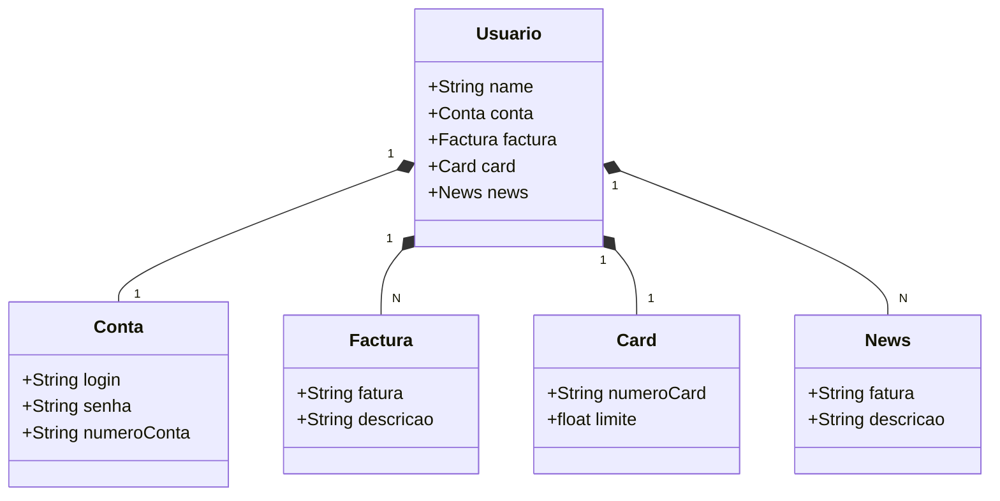

# Farmacia API BACK-AND
API JAVA BACK AND FARMACIA

```mermaid
classDiagram
    class Usuario {
        +String name
        +Conta conta
        +Factura factura
        +Card card
        +News news
    }

    class Conta {
        +String login
        +String senha
        +String numeroConta
    }

    class Factura {
        +String fatura
        +String descricao
    }

    class Card {
        +String numeroCard
        +float limite
    }

    class News {
        +String fatura
        +String descricao
    }

  Usuario "1" *-- "1" Conta
  Usuario "1" *-- "N" Factura
  Usuario "1" *-- "1" Card
  Usuario "1" *-- "N" News
```
